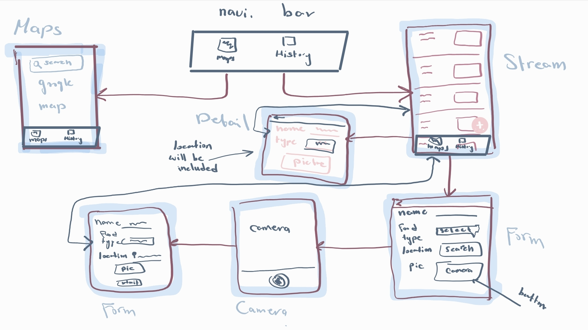

# Milestone 1 - Excess Gone

## Table of Contents

1. [Overview](#Overview)
1. [Product Spec](#Product-Spec)
1. [Wireframes](#Wireframes)

## Overview

### Description

This app will allow to decrease food wastage, by connecting resaurants with homeless shelters to donate excess food to the homeless people, resulting in a good idea to solve the issue of hunger and food insecurity among the homeless. 

### App Evaluation

  - **Category:** Food Donating System
   - **Mobile:** This app will use location to find near by homeless shelters and it will use pictures of food to be donated using camera. 
   - **Story:** This app will reduce waste and helping with lowering chance of the food being wasted, and instead being used to help homeless people, in which the food is being put to good use. 
   - **Market:** This app targets unique market, which is the resturants and owners of resturants as well as homeless shelters.
   - **Habit:**  This app will be used everyday at the end of the working hours of the resturant to let the shelters know what is available to be donated the next day. 
   - **Scope:** The scope of this app is to use google maps API, use SQLite to save the information about resturants donating.

## Product Spec

### 1. User Features (Required and Optional)

**Required Features**

- [X] Create layouts - activities & fragment: 
* activity home has two fragments: map and history with navigation bar included. 
* three activities: home activity, form activity, detail activity.

- [ ] Use GoogleMap API to find homeles shelter near the Restaurant

- [ ] Add database for restaurant's profile
* Use firebase
* Create data to show past food given in the fragment of history

**Stretch Features**

- [ ] Chat between shelter and restaurant
- [ ] Bar graph analysing types of foods being donated from different restaurants
- [ ] turn navigation bar to hamburger menu
- [ ] food API to add to list 

### 2. Screen Archetypes

- Home Creation
    - User can search "homeless shelters near me", and then, go to another activity, and that activity shows the map with the results
- Stream
    - User can navigate to the database list of past given food, and scroll through that list
- New Food Creation
    - User can send request to send food donation data to the shelter
- Camera Creation
    - User presses button the form, leads them to take pics of the food they are giving.
- Detail
    - Sending request to see detail about the food

### 3. Navigation

**Tab Navigation** (Tab to Screen)

* Home
* History

**Flow Navigation** (Screen to Screen)

- Home Creation
    - If search 
        - Maps
    - If send request
        - New Food creation screen
- New Food Creation
    - Camera Creation
- Camera Creation
    -  New Food Creation
- History
    -  Stream
        -  Detail 

## Wireframes

[Add picture of your hand sketched wireframes in this section]

## GIFs of Milestones

